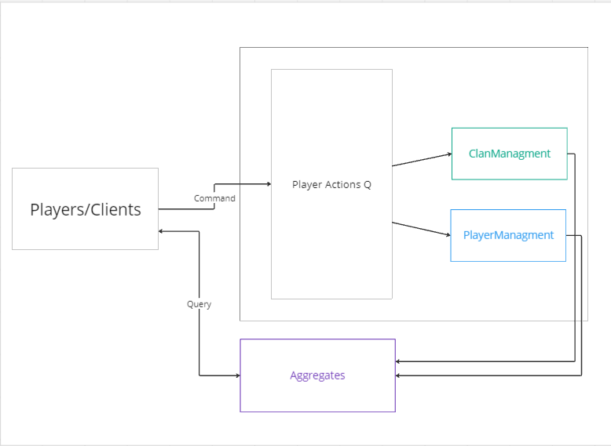
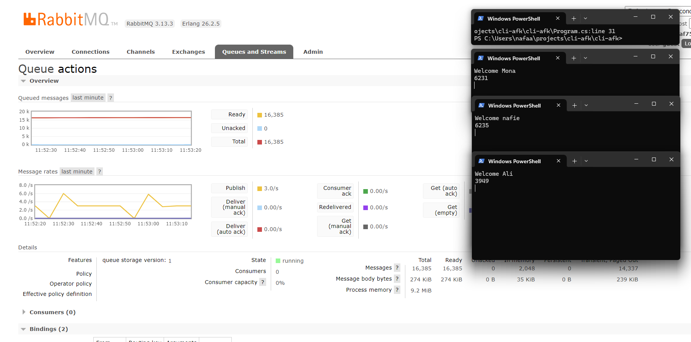

# CLI-AFK - Domain-Driven Design Documentation
<br>
<br>
<br>
<br>

# Overview


_High level overview_


This document describes the design of simple game using Domain-Driven Design (DDD) principles. The game allows players to earn points, join a clan, and contribute points to their clans.

### Glossary
1. **Player**: The user
2. **PlayerEarn**: The player earning points (when entered the playing state in client app).
3. **PlayerContribution**: The player earning in a clan (already joined a clan).


### Entities

1. **Player**: The player is the main entity. Each player has a unique ID, a name and a PlayerEarn records, which the some of it indicate the player total earned points.

2. **Clan**: A clan is a group of players. Each clan has a unique ID, a name, and points which is the sum of its players contributions.

### Value Objects
1. **PlayerEarn**: Player earning records, the total of records indicate player total points.
2. **PlayerContribution**: Player points contribution in a clan, the total contributions in a clan indicate the clan total points, the total contributions of a player in a clan indicate the player total points in the clan.

### Aggregates
1. **Player**: The player is an aggregate root. All operations related to a player must go through the player aggregate.
2. **Clan**: Similarly, the clan is also an aggregate root. All operations related to a clan must go through the clan aggregate.

### Domain Events

1. **PlayerEarned**: This event is triggered when a player earn points.
2. **PointsContributed**: This event is triggered when a player earn point in a clan.

### Services

1. **ClanManagement Service**: This service handles the clan operations, adding and removing players, and managing clan points.
2. **PlayerManagement Service**: This service handles player operation, currently, earning only.


----
<br>
<br>
<br>
<br>

# Running

<br>

### Backend
Open a new terminal and navigate to Console app `cli-afk`.
install dependencies, then run the app
```powershell
dotnet restore
dotnet run
```
The app will run and wait for messages to consume.
```console
Service is running and waiting for messages to consume!
|
```

### Client
Open a new terminal and navigate to Console app `cli-afk-client`.
install dependencies, then run the app
```powershell
dotnet restore
dotnet run
```
The app will run and you'll be asked to login with a username.
```bash
----------- Welcome! -------
Enter your player name to login
|
```

```console
Welcome <name>
    Enter the following options to perform an action:
    1 - Start playing
    2 - List clans


```

Enter 1 to start playing.

Every time you play, you start with 0, the number will increase by 1 for every second as long as you playing.
```console
Welcome <name>
5507

```

from Database
```sql
sqlite> select name from player;
Ali
Mona
nafie
sqlite> select name from clan;
Knights
Samurai
Vikings
sqlite> select sum(points) from player_contribution where player_id = 'nafie' and clan_id = 'Knights';
2208
sqlite> select name, clan_id from player;
nafie|Knights
Mona|
Ali|
sqlite> select sum(points) from player_contribution where player_id = 'nafie' and clan_id = 'Knights';
2208
sqlite> select sum(points) from player_earn where player_id = 'Mona';
5667
sqlite> select sum(points) from player_earn where player_id = 'Ali';
3410
```

From RabbitMQ Dashboard
